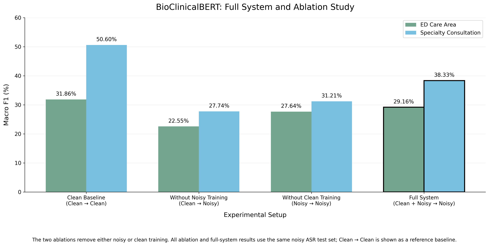
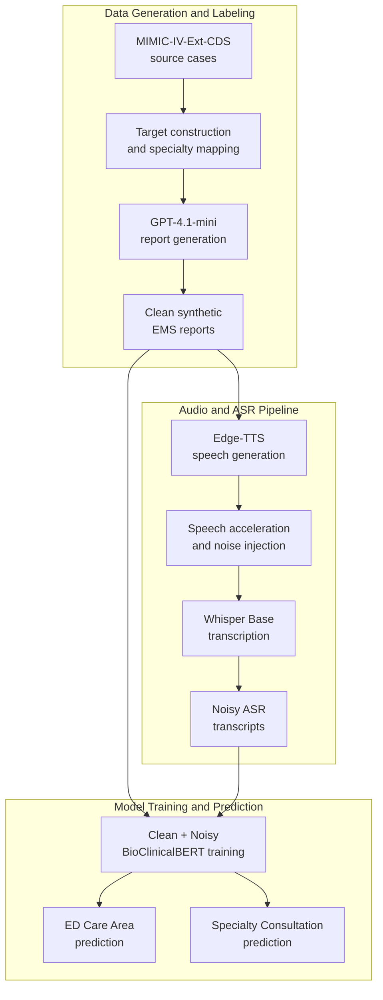
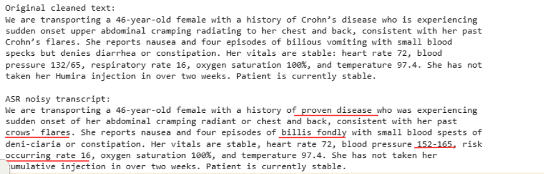
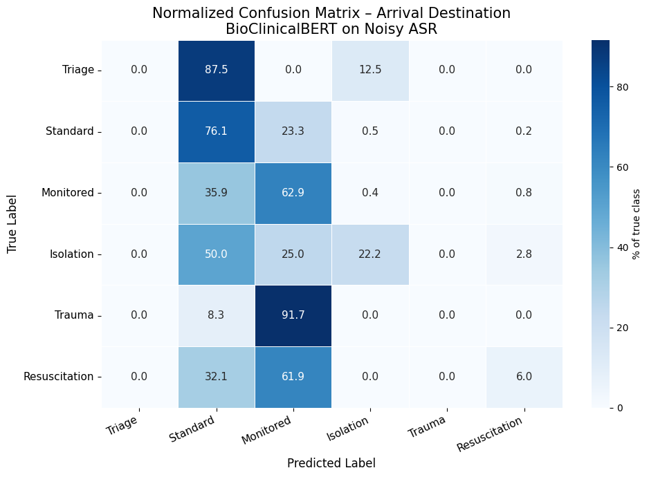
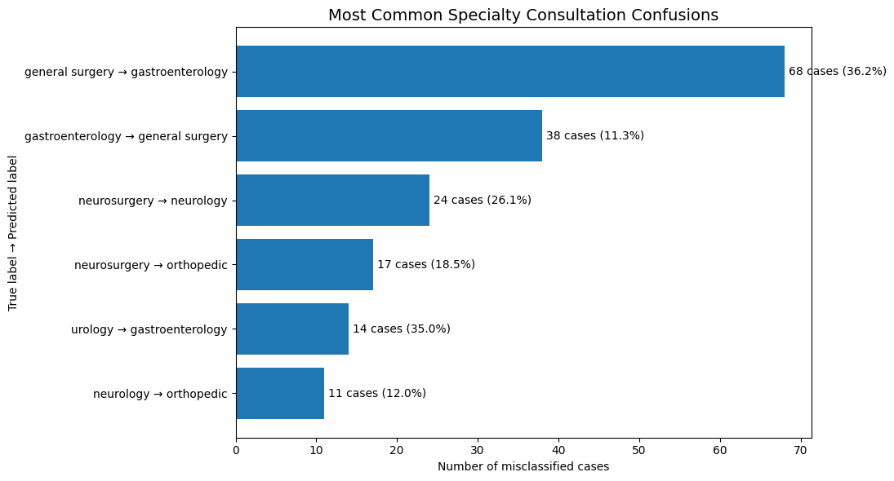

# MedAlert: ED Decision Classification from LLM-Generated EMS Reports under ASR Noise

**Improving Robustness to ASR Noise with Clean and Noisy Training**

**Authors:** Nofar Refaeli and Meital Gerasi

## Overview

MedAlert is an end-to-end NLP pipeline for generating synthetic Emergency Medical Services (EMS) pre-arrival reports and predicting Emergency Department (ED) preparation decisions from transcripts affected by automatic speech recognition (ASR) noise.

The final system trains BioClinicalBERT on both clean EMS reports and noisy ASR transcripts.

This repository contains the code, project-generated datasets, results, visuals, audio examples, and presentation materials for the MedAlert project.

---

## Main Result: Clean + Noisy Training

Our full system trains **BioClinicalBERT on both clean EMS reports and noisy ASR transcripts** and evaluates it on the same noisy ASR test set used across all noisy-evaluation experiments.

This combined strategy achieved the highest noisy-test Macro F1 for both prediction targets:

| Prediction Target      | Full-System Macro F1 |
| ---------------------- | -------------------: |
| ED Care Area           |           **29.16%** |
| Specialty Consultation |           **38.33%** |



These results are consistent with clean and noisy reports providing complementary training signals. Clean text may help preserve the original clinical wording, while noisy transcripts expose the model to ASR-related distortions.

---

## Ablation Study

The ablation study tested whether both clean and noisy training examples were needed.

The full system was:

> **Clean + Noisy → Noisy**

Two ablations were evaluated:

1. Removing noisy training:

   > **Clean → Noisy**

2. Removing clean training:

   > **Noisy → Noisy**

| Target                 | Full System: Clean + Noisy | Without Noisy Training | Without Clean Training |
| ---------------------- | -------------------------: | ---------------------: | ---------------------: |
| ED Care Area           |                 **29.16%** |                 22.55% |                 27.64% |
| Specialty Consultation |                 **38.33%** |                 27.74% |                 31.21% |

Removing noisy training reduced Macro F1 by **6.61 percentage points** for ED Care Area and **10.59 points** for Specialty Consultation. Removing clean training reduced it by **1.52** and **7.12 points**, respectively.

The results show that removing either component reduced performance compared with the complete clean-and-noisy system. All ablation and full-system results were evaluated on the same noisy ASR test set.

### Clean-Text Reference Baseline

`Clean → Clean` was evaluated using clean text rather than noisy ASR transcripts, so it is a reference baseline rather than a direct ablation comparison. Its Macro F1 was **31.86%** for ED Care Area and **50.60%** for Specialty Consultation.

---

## Project Motivation

EMS pre-arrival reports can help the ED prepare before a patient arrives, including selecting an appropriate care area and anticipating relevant specialty support.

However, these reports may be:

* Short or incomplete
* Variable in wording
* Communicated rapidly
* Affected by ambulance noise and sirens
* Distorted during automatic transcription

A classifier trained only on clean text may therefore perform poorly when evaluated on noisy ASR transcripts.

---

## Problem Statement

Given an EMS pre-arrival report, the project predicts two ED decision targets.

### 1. ED Care Area

Example classes include:

* Triage or waiting room
* Standard ED bed
* Monitored bed
* Isolation room
* Trauma bay
* Resuscitation bay

### 2. Primary Specialty Consultation

The original specialty values were mapped into **18 broader clinical consultation categories**.

Examples include:

* Cardiology
* Neurology
* Orthopedics
* Gastroenterology
* General Surgery

The main research question was:

> Can combined training on clean EMS reports and noisy ASR transcripts improve classification robustness under ASR noise?

---

## Visual Abstract




---

## Dataset

### Source Dataset

The project was based on:

**MIMIC-IV-Ext Clinical Decision Support for Referral, Triage and Diagnosis — Version 1.0.2**

[View the source dataset on PhysioNet](https://physionet.org/content/mimic-iv-ext-cds/1.0.2/)

The original MIMIC-IV-Ext-CDS source tables are not included in this repository.

### Project-Generated Dataset

The final generated dataset contains:

* **2,139 source cases**
* **4 EMS report variants per source case**
* **8,556 synthetic EMS reports**

### Clean Dataset

[View or download the final clean synthetic dataset](https://raw.githubusercontent.com/nofarGIT1/medalert-llm-ems-voice-ed-classification/main/data/generated_ems_reports_arrival_specialty_consult_v1_cleaned_final.csv)

### Noisy ASR Dataset

[Download the full noisy ASR dataset](https://raw.githubusercontent.com/nofarGIT1/medalert-llm-ems-voice-ed-classification/main/data/ems_asr_noisy_dataset_8556.zip)


---

## Data Generation and Augmentation

### Target Creation

The two prediction targets were prepared using different approaches. The ED care-area target was constructed using rule-based criteria based on the source clinical information. The specialty-consultation target was derived from LLM-generated specialty referrals provided in the MIMIC-IV-Ext dataset and mapped into 18 broader consultation categories.

### Synthetic EMS Report Generation

GPT-4.1-mini generated four EMS pre-arrival report variants for each source case:

* `professional_complete`
* `brief_radio_missing_details`
* `patient_reported_uncertain`
* `distracted_or_disorganized_handoff`

The generated reports were checked for target leakage and processed using two rounds of LLM-based post-processing.

### TTS and ASR Pipeline

The audio pipeline included:

* Text-to-speech generation using **Edge-TTS**
* Use of a synthetic male voice
* Speech acceleration to simulate a rapid EMS handoff
* Synthetic ambulance-like siren generation
* White background-noise injection
* Noisy-audio transcription using **Whisper Base**
* Word Error Rate calculation

The final experiments focused on the very-high-noise ASR setting, with an average WER of approximately **44%**.

---

## Input and Output Examples

### Clean Report vs. Noisy ASR Transcript



The ASR transcript preserves the main clinical context while introducing errors in medical terminology, medications, and numerical values.

### Audio Example

A separate noisy audio sample generated by the audio pipeline is available below:

[⬇️ Download a noisy EMS voice report](https://raw.githubusercontent.com/nofarGIT1/medalert-llm-ems-voice-ed-classification/main/audio/sample_0_noisy.wav)

---

## Models and Pipelines

| Pipeline Stage                           | Model or Method                 |
| ---------------------------------------- | ------------------------------- |
| Synthetic EMS report generation          | GPT-4.1-mini                    |
| Text-to-speech                           | Edge-TTS                        |
| Noise generation                         | Synthetic siren and white noise |
| Audio transcription                      | Whisper Base                    |
| General-language classification baseline | DistilBERT                      |
| Main clinical classification model       | BioClinicalBERT                 |

### BioClinicalBERT

BioClinicalBERT was selected as the main model because noisy training improved its Macro F1 consistently across both targets, whereas DistilBERT did not show the same pattern.

### DistilBERT

DistilBERT is a smaller, general-purpose Transformer model used as a comparison baseline to evaluate whether a non-clinical model behaved differently under ASR noise.

[View the complete BioClinicalBERT and DistilBERT results](results/final_model_results.csv)

---

## Training Process and Parameters

The data were split by `source_case_id`, ensuring that all variants generated from the same clinical case remained in the same split.

This prevented source-case leakage between training, validation, and testing.

Four experimental setups were evaluated:

* Clean → Clean
* Clean → Noisy ASR
* Noisy ASR → Noisy ASR
* Clean + Noisy ASR → Noisy ASR

### Selected BioClinicalBERT Configurations

| Target                 | Fine-Tuning Strategy            | Max Length | Epochs | Learning Rate | Class Weights |
| ---------------------- | ------------------------------- | ---------: | -----: | ------------: | ------------- |
| ED Care Area           | Last 8 encoder layers trainable |        128 |      3 |          2e-5 | No            |
| Specialty Consultation | Full fine-tuning                |        192 |      3 |          2e-5 | No            |

For combined training, each training report was represented twice:

* Once using its clean text
* Once using its noisy ASR transcript

For the combined setup, validation and test evaluation used noisy ASR transcripts only.

---

## Metrics

### Classification Metrics

* **Macro F1** — primary metric because the target classes were imbalanced
* Accuracy
* Per-class precision, recall, and F1 for error analysis

### ASR Metric

* **Word Error Rate (WER)** — measures the difference between the original clean report and its ASR transcript

---

## Error Analysis

### ED Care Area

The most common confusion occurred between:

* `standard_ed_bed`
* `monitored_bed`

Rare labels such as trauma bay and triage or waiting room showed lower recall.



### Specialty Consultation

Several errors occurred between clinically related specialties, particularly between General Surgery and Gastroenterology, Neurosurgery and Neurology, and neurological or neurosurgical cases predicted as Orthopedic Consultation.



Among predictions counted as incorrect against the primary specialty label, **11.48% were valid secondary specialty labels** according to the multi-label annotation.

This suggests that the specialty-consultation task may be better represented as a multi-label classification problem in future work.

---

## Limitations

* ED care-area labels were rule-based, while specialty labels came from LLM-generated referrals without full clinician validation.
* The audio used a synthetic voice, siren, and background noise rather than real ambulance recordings.
* The pipeline did not represent the full variability of real EMS speakers, accents, devices, and radio channels.
* Several target classes contained relatively few examples.
* Specialty consultation was evaluated as a single-label task even though some cases had multiple relevant specialties.
* Performance under severe ASR noise remained below the clean-text reference baseline.
* This project is a research proof of concept and has not been clinically validated for real-time decision support.

---

## Future Work

Future improvements may include:

* Modeling specialty consultation as a multi-label or top-k prediction task
* Testing different clean-to-noisy training ratios
* Adding more examples for rare ED care-area classes
* Evaluating real ambulance audio with more voices, accents, speaking rates, and noise conditions
* Evaluating medical-domain ASR models
* Validating the targets and predictions with clinical experts

---

## Repository Structure

```text
medalert-ems-voice-classification/
├── notebooks/
│   ├── 01_MedAlert_Data_Generation_Labeling_and_Modeling.ipynb
│   └── 02_MedAlert_TTS_Noise_and_ASR_Pipeline.ipynb
│
├── data/
│   ├── generated_ems_reports_arrival_specialty_consult_v1_cleaned_final.csv
│   └── ems_asr_noisy_dataset_8556.zip
│
├── results/
│   └── final_model_results.csv
│
├── visuals/
│   ├── asr_clean_vs_noisy_example.png
│   ├── arrival_confusion_matrix_normalized.png
│   ├── specialty_common_confusions.png
│   └── bioclinicalbert_macro_f1_training_setups.png
│
├── audio/
│   └── sample_0_noisy.wav
│
└── slides/
    ├── MedAlert_Final_Presentation.pptx
    ├── MedAlert_Final_Presentation.pdf
    ├── MedAlert_Interim_Presentation.pptx
    └── MedAlert_Interim_Presentation.pdf
```

---

## Notebooks

### Main Data and Modeling Notebook

[`notebooks/01_MedAlert_Data_Generation_Labeling_and_Modeling.ipynb`](notebooks/01_MedAlert_Data_Generation_Labeling_and_Modeling.ipynb)

Includes:

* Source-data preparation and rule-based target creation
* Synthetic EMS report generation using GPT-4.1-mini
* Leakage checks and LLM-based text post-processing
* Predefined train, validation, and test splits by `source_case_id`
* Transformer training, model comparison, and error analysis

### TTS and ASR Pipeline Notebook

[`notebooks/02_MedAlert_TTS_Noise_and_ASR_Pipeline.ipynb`](notebooks/02_MedAlert_TTS_Noise_and_ASR_Pipeline.ipynb)

Includes:

* Text-to-speech generation using Edge-TTS
* Speech-speed adjustment and ambulance-related noise injection
* Noisy-audio transcription using Whisper Base
* Word Error Rate calculation and quality checks
* Checkpoint handling and final ASR dataset preparation

---

## Presentations

* [Final Presentation — PDF](slides/MedAlert_Final_Presentation.pdf)
* [Download Final Presentation — PowerPoint](slides/MedAlert_Final_Presentation.pptx?raw=1)
* [Interim Presentation — PDF](slides/MedAlert_Interim_Presentation.pdf)
* [Download Interim Presentation — PowerPoint](slides/MedAlert_Interim_Presentation.pptx?raw=1)

---

## Reproducibility Notes

The notebooks were developed in Google Colab.

Some stages require:

* Google Drive access
* A GPU runtime for Transformer training
* An OpenAI API key for synthetic report generation and post-processing
* Internet access for downloading pretrained models and running the TTS and ASR stages

Large trained-model checkpoints and the complete collection of generated audio files are not included in the repository.

Developed as part of the B.Sc. program in Digital Technologies in Medicine at the Holon Institute of Technology (HIT).
