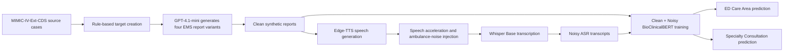

# MedAlert: LLM-Based EMS Voice Report Classification for ED Decisions

**Improving Robustness to ASR Noise with Clean and Noisy Training**

**Authors:** Nofar Refaeli and Meital Gerasi

MedAlert is an end-to-end pipeline for generating synthetic EMS pre-arrival voice reports and predicting emergency department decisions from transcripts affected by ASR noise.

This repository contains the code, project-generated datasets, results, visuals, audio examples, and presentation materials for the MedAlert project.


---

## Main Result: Clean + Noisy Training

Our full system trains BioClinicalBERT on both clean EMS reports and noisy ASR transcripts and evaluates it on the same noisy ASR test set used across all experiments.

This combined strategy achieved the highest noisy-test Macro F1 for both prediction targets:

| Prediction Target      | Full System Macro F1 |
| ---------------------- | -------------------: |
| ED Care Area           |           **29.16%** |
| Specialty Consultation |           **38.33%** |


The results indicate that clean and noisy training examples provide complementary information: noisy transcripts improve robustness to transcription errors, while clean reports help preserve the clinical and linguistic signal.

---

## Ablation Study

To evaluate whether both training components were necessary, we removed one component at a time.

| Target                 | Full System: Clean + Noisy | Without Noisy Training | Without Clean Training |
| ---------------------- | -------------------------: | ---------------------: | ---------------------: |
| ED Care Area           |                 **29.16%** |                 22.55% |                 27.64% |
| Specialty Consultation |                 **38.33%** |                 27.74% |                 31.21% |

Removing noisy training reduced Macro F1 by:

* **6.61 percentage points** for ED Care Area
* **10.59 percentage points** for Specialty Consultation

Removing clean training also reduced performance:

* **1.52 percentage points** for ED Care Area
* **7.12 percentage points** for Specialty Consultation

These ablations support the use of both clean and noisy reports in the final system.

> `Clean → Clean` is included in the figure as a reference baseline.
> All ablation and full-system results were evaluated on the same noisy ASR test set.

---

## Project Motivation

EMS pre-arrival reports can provide the emergency department with early information about a patient's condition and required preparation.

In practice, voice reports may be transcribed automatically under challenging conditions such as:

* Ambulance and siren noise
* Fast speech
* Medical terminology
* Medication names
* Vital-sign values
* Incomplete or disorganized handoffs

A model trained only on clean text may therefore perform poorly when deployed on real ASR transcripts.

---

## Problem Statement

The project investigates whether ED decisions can be predicted from noisy EMS pre-arrival transcripts.

Two classification tasks were defined:

### 1. ED Care Area

Predict the appropriate receiving area:

* Triage or waiting room
* Standard ED bed
* Monitored bed
* Isolation room
* Trauma bay
* Resuscitation bay

### 2. Specialty Consultation

Predict the primary medical specialty consultation required for the case.

The original specialty values were mapped into **18 broader clinical consultation categories**.

---

## Visual Abstract



---

## Datasets

### Source Dataset

The clinical source cases were obtained from **MIMIC-IV-Ext-CDS**.

The original source tables are not included in this repository.

### Project-Generated Dataset

The final project dataset contains:

* **2,139 source cases**
* **4 EMS report variants per source case**
* **8,556 synthetic EMS reports**

The clean dataset is available here:

[`data/generated_ems_reports_arrival_specialty_consult_v1_cleaned_final.csv`](data/generated_ems_reports_arrival_specialty_consult_v1_cleaned_final.csv)

The full noisy ASR dataset is available as a ZIP file:

[`data/ems_asr_noisy_dataset_8556.zip`](data/ems_asr_noisy_dataset_8556.zip)

The noisy dataset contains the ASR transcripts and Word Error Rate values.

---

## Data Generation and Augmentation

GPT-4.1-mini generated four EMS pre-arrival report variants for each source case:

* `professional_complete`
* `brief_radio_missing_details`
* `patient_reported_uncertain`
* `distracted_or_disorganized_handoff`

The generated reports were checked for target leakage and processed using two rounds of LLM-based post-processing.

The audio pipeline then applied:

1. Text-to-speech generation using Edge-TTS
2. Speech-speed adjustment
3. Synthetic ambulance-related noise injection
4. ASR transcription using Whisper Base
5. Word Error Rate calculation

---

## Input and Output Examples

### Clean Report vs. Noisy ASR Transcript


The ASR transcript preserves the main clinical context while introducing errors in medical terminology, medications, and numerical values.

### Audio Example

A separate noisy audio sample generated by the audio pipeline is available below:

[▶️ Listen to a noisy EMS voice report](audio/sample_0_noisy.wav)

---

## Models and Pipelines

The project uses the following models and tools:

| Pipeline Stage                  | Model or Method |
| ------------------------------- | --------------- |
| Synthetic EMS report generation | GPT-4.1-mini    |
| Text-to-speech                  | Edge-TTS        |
| Audio transcription             | Whisper Base    |
| Text classification baselines   | DistilBERT      |
| Main classification model       | BioClinicalBERT |

BioClinicalBERT was selected as the main model because it generally achieved stronger Macro F1 performance, particularly for specialty consultation.

---

## Training Process and Parameters

The data were split by `source_case_id`, ensuring that all variants generated from the same clinical case remained in the same split.

This prevented source-case leakage between training, validation, and testing.

Four experimental setups were evaluated:

* Clean → Clean
* Clean → Noisy ASR
* Noisy ASR → Noisy ASR
* Clean + Noisy ASR → Noisy ASR

### Selected BioClinicalBERT Configurations

| Target                 | Fine-Tuning Strategy            | Max Length | Epochs | Learning Rate | Class Weights |
| ---------------------- | ------------------------------- | ---------: | -----: | ------------: | ------------- |
| ED Care Area           | Last 8 encoder layers trainable |        128 |      3 |          2e-5 | No            |
| Specialty Consultation | Full fine-tuning                |        192 |      3 |          2e-5 | No            |

For combined training, each training report was represented twice:

* Once using its clean text
* Once using its noisy ASR transcript

Validation and test evaluation used noisy ASR transcripts only.

---

## Metrics

### Classification Metrics

* **Macro F1** — primary metric because the target classes were imbalanced
* Accuracy
* Per-class precision, recall, and F1 for error analysis

### ASR Metric

* **Word Error Rate (WER)** — measures the difference between the original clean report and the ASR transcript

The full comparison table is available here:

[`results/final_model_results.csv`](results/final_model_results.csv)

---

## Error Analysis

### ED Care Area

The most common confusion occurred between:

* `standard_ed_bed`
* `monitored_bed`

Rare labels such as trauma bay and triage or waiting room showed lower recall.


### Specialty Consultation

Several errors occurred between clinically related specialties, including:

* General Surgery and Gastroenterology
* Neurosurgery and Neurology
* Neurology and Orthopedics


The multi-label analysis also showed that some predictions counted as incorrect primary labels were valid secondary specialty annotations.

---

## Repository Structure

```text
medalert-ems-voice-classification/
├── notebooks/
│   ├── 01_MedAlert_Data_Generation_Labeling_and_Modeling.ipynb
│   └── 02_MedAlert_TTS_Noise_and_ASR_Pipeline.ipynb
│
├── data/
│   ├── generated_ems_reports_arrival_specialty_consult_v1_cleaned_final.csv
│   └── ems_asr_noisy_dataset_8556.zip
│
├── results/
│   └── final_model_results.csv
│
├── visuals/
│   ├── asr_clean_vs_noisy_example.png
│   ├── arrival_confusion_matrix_normalized.png
│   ├── specialty_common_confusions.png
│   └── bioclinicalbert_macro_f1_training_setups.png
│
├── audio/
│   └── sample_0_noisy.wav
│
└── slides/
    ├── MedAlert_Final_Presentation.pptx
    ├── MedAlert_Final_Presentation.pdf
    ├── MedAlert_Interim_Presentation.pptx
    └── MedAlert_Interim_Presentation.pdf
```

---

## Notebooks

### Main Data and Modeling Notebook

[`notebooks/01_MedAlert_Data_Generation_Labeling_and_Modeling.ipynb`](notebooks/01_MedAlert_Data_Generation_Labeling_and_Modeling.ipynb)

Includes:

* Source-data preparation and rule-based target creation
* Synthetic EMS report generation using GPT-4.1-mini
* Leakage checks and LLM-based text post-processing
* Predefined train, validation, and test splits by source_case_id
* Transformer training, model comparison, and error analysis

### TTS and ASR Pipeline Notebook

[`notebooks/02_MedAlert_TTS_Noise_and_ASR_Pipeline.ipynb`](notebooks/02_MedAlert_TTS_Noise_and_ASR_Pipeline.ipynb)

Includes:

* Text-to-speech generation using Edge-TTS
* Speech-speed adjustment and ambulance-related noise injection
* Noisy-audio transcription using Whisper Base
* Word Error Rate calculation and quality checks
* Checkpoint handling and final ASR dataset preparation

---

## Presentations

* [Final Presentation — PDF](slides/MedAlert_Final_Presentation.pdf)
* [Final Presentation — PowerPoint](slides/MedAlert_Final_Presentation.pptx)
* [Interim Presentation — PDF](slides/MedAlert_Interim_Presentation.pdf)
* [Interim Presentation — PowerPoint](slides/MedAlert_Interim_Presentation.pptx)

---

## Reproducibility Notes

The notebooks were developed in Google Colab.

Some stages require:

* Google Drive access
* A GPU runtime for Transformer training
* An OpenAI API key for synthetic report generation and post-processing

Large trained-model checkpoints and the complete collection of generated audio files are not included in the repository.

---

## Team Members

* Nofar Refaeli
* Meital Gerasi

